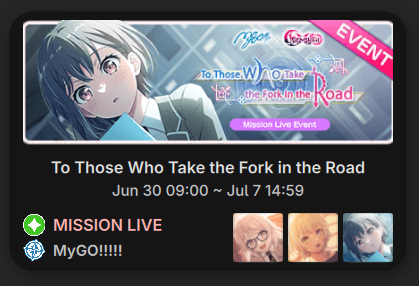

# 🎸 Bestdori Event Widget for Noctalia

A boppin' little desktop widget for [Noctalia Shell](https://github.com/noctalia-dev/noctalia) that displays the latest active **Bang Dream! Girls Band Party!** server event and its featured cards.



## ⚡ Features

- **Multi-Server Support**: Track events from JP, EN, TW, or CN servers via the settings UI.
- **Live Event Info**: Automatically tracks the most recent event from Bestdori for your chosen server.
- **Event Metadata**: Displays the event banner, type (e.g., MISSION LIVE), attribute icon (Pure, Cool, etc.), and duration.
- **Smart Band Matching**: Analyzes the featured characters and resolves their band. Displays the band icon and name (e.g., MyGO!!!!!) or shows "Mixed" if characters are from different bands.
- **Featured Cards**: Fetches and renders 40x40px icons for all event cards.
- **High-Speed Local Cache**: API responses and assets (images/SVGs) are cached locally in the plugin directory. The widget loads instantly (~1.6s news check, 0ms for everything else) and works offline!

## 🖥️ Settings

- **Game Server**: Choose between Japanese, English, Taiwanese, or Chinese servers.

## 📂 File Structure

```
bestdori-event/
├── manifest.json       # Plugin registration
├── Main.qml            # Backend process runner & timer (updates every 5m)
├── DesktopWidget.qml   # Clean, compact QML UI (240px height, auto-sizing)
├── fetch.py            # Python helper for caching & data parsing
└── cache/              # Local cache directory
    ├── api/            # Cached event and card JSON files
    └── assets/         # Cached banners, attributes, band, and card icons
```

## 🛠️ How to Enable

1. Place this directory under `~/.config/noctalia/plugins/bestdori-event/`.
2. Add the plugin to your `~/.config/noctalia/plugins.json` under `states`:
   ```json
   "bestdori-event": {
       "enabled": true,
       "sourceUrl": "https://github.com/noctalia-dev/noctalia-plugins"
   }
   ```
3. Restart Noctalia Shell!
